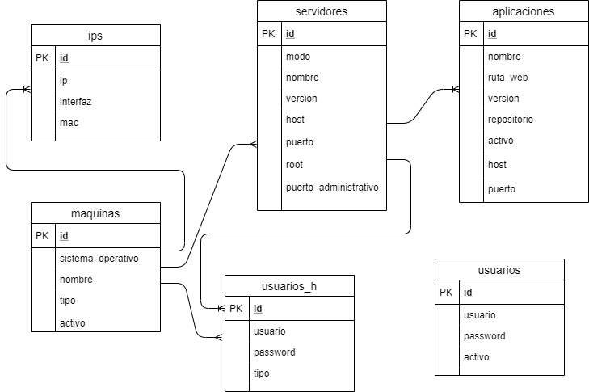

# Administrador de Servidores, ASE.

URL Trello:

https://trello.com/useristradordeservidores1

Modelo Entidad-Relación

Diccionario de Datos.

ips:

ip: Dirección ip
interfaz: Interfaz física de la red
mac: Mac Address de la interfaz de red

maquinas:

sistema_operativo:
nombre:Nombre de la máquina (host)
tipo:Es un servidor o un cliente
activo:Si la máquina sigue en funcionamiento

servidores:

modo:
nombre: El nombre del servidor (ejem: glassfish)
version: La versión instalda del servidor
host: O dominio, nombre del servidor
puerto: puerto de escucha
root: directorio de instalación
puerto_administrativo: Puerto administrativo del servidor, si poseé, como glassfish

aplicaciones:
nombre: El nombre de la aplicación
ruta_web: El path para acceder a la aplicación (Ejem: /)
version: La última versión en producción
repositorio: Url del repositorio del codigo fuente
activo: Si la aplicación se encuentra activa
host: En caso de ser un servidor virtual en base a un nombre de servidor, en caso contrario poner null (sobre el servidor virtual por defecto)
puerto: En caso de que su servidor virtual esté sobre otro puerto, en caso contrario, poner null