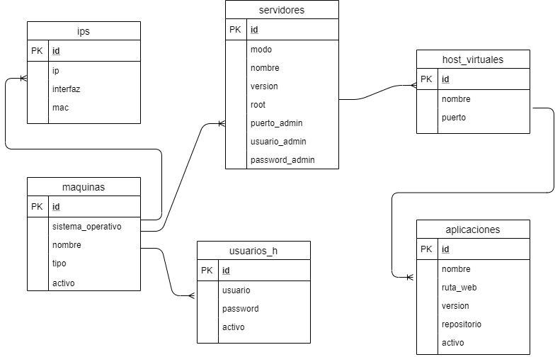

# Administrador de Servidores, ASE.

URL Trello:

https://trello.com/useristradordeservidores1

Modelo Entidad-Relación

Diccionario de Datos. 
 
ips: 
 
ip: Dirección ip. 
interfaz: Interfaz física de la red. 
mac: Mac Address de la interfaz de red. 
 
maquinas: 
 
sistema_operativo: 
nombre:Nombre de la máquina (host) 
tipo:Es un servidor o un cliente 
activo:Si la máquina sigue en funcionamiento 
 
servidores: 
 
modo: 
nombre: El nombre del servidor (ejem: glassfish) 
version: La versión instalda del servidor 
host: O dominio, nombre del servidor 
puerto: puerto de escucha 
root: directorio de instalación 
puerto_administrativo: Puerto administrativo del servidor, si poseé, como glassfish 
 
aplicaciones: 
nombre: El nombre de la aplicación 
ruta_web: El path para acceder a la aplicación (Ejem: /) 
version: La última versión en producción 
repositorio: Url del repositorio del codigo fuente 
activo: Si la aplicación se encuentra activa 
host: En caso de ser un servidor virtual en base a un nombre de servidor 
puerto: En caso de que su servidor virtual esté sobre otro puerto 

Ejemplo de .env

ENV=development 
MYSQL_HOST=192.168.3.3#debe apuntar a la ip del contenedor de mariadb 
MYSQL_USER=test 
MYSQL_PASSWORD=test 
MYSQL_DATABASE=ase 

Levantar docker compose (MYSQL_USER, MYSQL_PASSWORD, MYSQL_DATABASE deben ser iguales que en .env):

MYSQL_ROOT_PASSWORD=anything MYSQL_USER=test MYSQL_PASSWORD=test MYSQL_DATABASE=ase docker-compose up --build -d

Para ejecutar servidor de desarrollo:

Entar al contenedor: 

docker exec -it ase bash

Estando adentro:

cd /home/ase 
DJANGO_SETTINGS_MODULE=ase.settings PYTHONPATH=. django-admin runserver 0:5000 